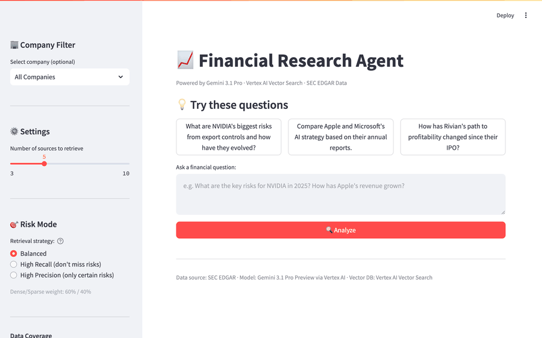

# Multi-Horizon Financial Research Agent

> Domain-specialized Gemma 2 27B **and** Gemma 4 31B for SEC filings, fine-tuned on TPU v6e-8 with PyTorch/XLA FSDPv2 — plus a Vertex AI Vector Search RAG demo for interactive queries.


---

## TL;DR

- **What:** a LoRA adapter specialized for SEC financial QA, trained on 1,060 knowledge-distilled QA pairs from 381 SEC filing summaries (10-K, 10-Q, 8-K). Applied to *both* Gemma 2 27B (Phase 1) and Gemma 4 31B (Phase 2).
- **Where it runs:** TPU v6e-8 (Trillium) via HuggingFace PEFT + PyTorch/XLA with SPMD FSDPv2 param-sharding in bf16.
- **Phase 1 result (Gemma 2 27B):** BERTScore F1 0.8078 → 0.8361 (**+3.50%**), paired *t* = 3.64 (p < 0.01), v2 beats base on **16/20** items.
- **Phase 2 result (Gemma 4 31B):** BERTScore F1 0.8283 → 0.8760 (**+5.76%**), paired *t* = 10.42 (p < 0.001), v2g4 beats base on **20/20** items. The same adapter recipe transfers cleanly to the newer base and the effect gets *larger*. See [§ Phase 2 — Gemma 4 migration](#phase-2--gemma-4-migration).
- **Adapters on HuggingFace Hub:** [`Srx7703/gemma-2-27b-financial-adapter`](https://huggingface.co/Srx7703/gemma-2-27b-financial-adapter) · [`Srx7703/gemma-4-31b-financial-adapter`](https://huggingface.co/Srx7703/gemma-4-31b-financial-adapter) — load directly with `peft.PeftModel.from_pretrained(...)`.
- **Separate RAG demo:** Streamlit app over Vertex AI Vector Search + Gemini 3.1 Pro, covering **69 S&P 500 tickers × 381 filings (10-K / 10-Q / 8-K)**, with a dedicated Data Coverage page and SEC EDGAR deep-links. See [§ Streamlit demo](#streamlit-demo).

Full trade-off discussion in [ARCHITECTURE.md](ARCHITECTURE.md).

---

## What this is (and isn't)

**This is two things, sharing a data pipeline:**

1. **Knowledge-distillation pipeline** — 69 S&P 500 companies' SEC filings (10-K + 10-Q + 8-K) are summarized by Gemini 3.1 Pro, turned into 1,060 analyst-style QA pairs, and used to fine-tune Gemma 2 27B with LoRA on TPU. Evaluated by BERTScore.
2. **RAG demo** — a Streamlit app that runs hybrid retrieval (dense + BM25) over **381 SEC filings (23 × 10-K + 136 × 10-Q + 222 × 8-K)** across 69 S&P 500 tickers in Vertex AI Vector Search, then synthesizes answers with Gemini 3.1 Pro. Filtering by ticker *and* filing type, source-level expanders, SEC EDGAR deep-links.

The RAG demo exists to make the data pipeline tangible — you can ask questions and see the retrieval + generation flow. The Gemma fine-tune is the research artifact; it is not served from the Streamlit app (the adapter lives on the TPU VM; live inference from a laptop isn't practical for 27B).

---

## Pipeline at a glance

```
SEC EDGAR API (edgartools)
   ├─ 10-K summaries — 23 (5 tickers × 5 fiscal years — historical 10-K subset)  ┐
   ├─ 10-Q summaries — 136 (69 tickers × last 2 quarters)                         ├→ Vertex AI Vector Search (381 docs across 69 tickers) → RAG demo
   └─ 8-K  summaries — 222 (69 tickers × last 90 days)                            ┘
         │
         ▼
Gemini 3.1 Pro (Teacher)
   → 1,060 analyst-style QA pairs (finetune_data_v2/train.jsonl)
         │
         ├──────────────── Phase 1 ────────────────┐
         │                                         │
         │   Gemma 2 27B (Student) + LoRA rank=8   │
         │   FSDPv2 across 8 × TPU v6e (bf16)      │
         │   → gemma27b_financial_adapter_hf/      │
         │                  ↓                      │
         │   BERTScore vs base Gemma 2 27B         │
         │   → evaluation_results_v2.json          │
         │                                         │
         ├──────────────── Phase 2 ────────────────┤
         │                                         │
         │   Gemma 4 31B (Student) + LoRA rank=8   │
         │   Same recipe, transformers ≥ 5.6.2     │
         │   → gemma4_31b_financial_adapter_hf/    │
         │                  ↓                      │
         │   4-way BERTScore (base2 / 2+v2 /       │
         │                    base4 / 4+v2)        │
         │   → evaluation_results_phase2.json      │
         └─────────────────────────────────────────┘
```

---

## Model evaluation

Comparison on 20 held-out SEC QA items drawn from `finetune_data_v2/valid.jsonl` (no overlap with the 160 training examples used for the Phase 1 run).

| Model | BERTScore F1 | BERTScore P | BERTScore R |
|---|---:|---:|---:|
| Base Gemma 2 27B (no adapter) | 0.8078 | 0.7992 | 0.8167 |
| **Gemma 2 27B + LoRA (SEC data)** | **0.8361** | **0.8297** | **0.8439** |
| **Delta (relative)** | **+3.50%** | **+3.82%** | **+3.33%** |

**Statistical check (paired, n=20):**

| Statistic | Value |
|---|---|
| Mean F1 delta (v2 − base) | +0.0284 |
| Standard error | 0.0078 |
| Paired *t* (df=19) | **3.64** (p < 0.01) |
| 95% CI for the delta | [+0.0120, +0.0447] |
| Items where v2 beats base | **16 / 20** |

Effect is robust at this sample size: the 95% CI doesn't cross zero, and v2 wins on 80% of items.

**Qualitative change.** The base model refuses most financial questions with *"I do not have access to real-time data, including SEC filings..."* — safety boilerplate triggered by the analyst framing. The fine-tuned model produces structured analyst responses citing specific filings (*"The 2026-03-02 8-K is highly material to investors because..."*). The BERTScore delta captures a style shift more than a factual shift — which is exactly what LoRA on distilled-QA data is designed to produce.

Full per-item predictions: [`preds/preds_base.json`](preds/preds_base.json), [`preds/preds_v2.json`](preds/preds_v2.json).
Full report: [`evaluation_results_v2.json`](evaluation_results_v2.json).

---

## Phase 2 — Gemma 4 migration

Phase 2 re-runs the **same adapter recipe** (same 1,060-QA dataset, same LoRA rank/alpha, same FSDPv2 mesh, same hyperparameters) on Gemma 4 31B — a newer base with interleaved sliding/full attention and a multimodal language-model tower — to answer one question: *does the pipeline transfer?*

**4-way comparison (n=20, same held-out items):**

| Model | BERTScore F1 | BERTScore P | BERTScore R | Δ vs its base |
|---|---:|---:|---:|---:|
| Base Gemma 2 27B | 0.8078 | 0.7992 | 0.8167 | — |
| Gemma 2 27B + v2 LoRA | 0.8361 | 0.8297 | 0.8439 | **+3.50%** |
| Base Gemma 4 31B | 0.8283 | 0.8028 | 0.8558 | — |
| **Gemma 4 31B + v2 LoRA** | **0.8760** | **0.8717** | **0.8806** | **+5.76%** |

**Gemma 4 paired t-test (n=20):**

| Statistic | Value |
|---|---|
| Mean F1 delta (v2g4 − base4) | +0.0477 |
| Paired *t* (df=19) | **10.42** (p < 0.001) |
| 95% CI for the delta | [+0.0381, +0.0572] |
| Items where v2g4 beats base4 | **20 / 20** |

**Three things this shows:**

1. **The pipeline is portable.** The only code changes between `train_tpu_hf_peft.py` (Phase 1) and `train_tpu_gemma4.py` (Phase 2) are (a) the model ID, (b) a chat-template swap from `<start_of_turn>` to `apply_chat_template`, and (c) a regex-scoped LoRA `target_modules` to restrict injection to the `.language_model.` tower (Gemma 4 is multimodal; we don't want PEFT touching the vision-tower projections). FSDPv2 sharding, LoRA rank/alpha, batch size, optimizer — all unchanged.

2. **The effect is *stronger* on the newer base.** +5.76% vs +3.50%, wins 20/20 vs 16/20, *t* = 10.42 vs 3.64. Gemma 4 base has higher recall than Gemma 2 base (0.8558 vs 0.8167) — it already picks up more of the reference content — and the LoRA then contributes a large precision lift (0.8028 → 0.8717). The fine-tune is adding structure the base now has the headroom to absorb.

3. **Gemma 4 + v2 LoRA > Gemma 2 + v2 LoRA** by +4.77% — confirming that upgrading the base is additive on top of the adapter gain, not a substitute for it.

**What Phase 2 cost extra.** The two non-trivial issues weren't the migration itself; they were inference infrastructure:

- **HF 5.6.2 `StaticCache.__init__` bug.** `Gemma4TextConfig.num_kv_shared_layers = 0` triggers `layer_types[:-0]` → `[]` (Python slice gotcha: `-0 == 0`), so the cache comes up with no per-layer entries and the first decode step throws `IndexError`. Routed around in [`generate_tpu_gemma4.py:40-61`](generate_tpu_gemma4.py) by constructing the per-layer `StaticSlidingWindowLayer` / `StaticLayer` objects directly and grafting them onto a bare `Cache`.
- **DynamicCache → XLA graph bloat.** The HF default `DynamicCache` grows per token; on 31B that causes XLA to recompile on every decode iteration and the process hangs indefinitely. Fixed by pre-allocating a `StaticCache` and left-padding every prompt to `MAX_PROMPT = 256` so prefill and decode tensors have fully static shapes.

Full per-item predictions: [`preds/preds_gemma4_base.json`](preds/preds_gemma4_base.json), [`preds/preds_gemma4_v2g4.json`](preds/preds_gemma4_v2g4.json).
Full 4-way report: [`evaluation_results_phase2.json`](evaluation_results_phase2.json).
Design narrative: [ARCHITECTURE.md § Decision 7 — Why migrate to Gemma 4](ARCHITECTURE.md#decision-7--why-migrate-to-gemma-4).

---

## Fine-tuning setup

| Component | Value |
|---|---|
| Base model | `google/gemma-2-27b-it` (bf16) |
| Hardware | TPU v6e-8 (Trillium), 256 GB HBM total |
| Framework | HuggingFace `transformers` 4.45.2 + `peft` 0.13.2 + `torch-xla` 2.5.0 |
| Parallelism | SPMD FSDPv2, mesh `(8, 1)` over `("fsdp", "tensor")` |
| LoRA | rank=8, alpha=16, dropout=0.05 |
| LoRA targets | `q/k/v/o/gate/up/down_proj` (attention + MLP) |
| Sequence length | 512 |
| Batch size | 4 × 2 grad-accum = effective 8 |
| Optimizer | AdamW, lr=1e-4, wd=0.01 |
| Epochs | 2 over 160 examples (cap; full data is 1,060) |
| Precision | bf16 (matches Gemma 2 training precision) |
| Step time (post-compile) | ~7.4 s / optimizer step |
| Trained adapter size | 228 MB |

Training loss fell from 3.21 → 1.16 over 40 optimizer steps. See [ARCHITECTURE.md](ARCHITECTURE.md) for why each number is what it is, including why `bs=4 no-GC` beat `bs=2 with gradient checkpointing` by ~30×.

---

## Streamlit demo



```bash
pip install -r requirements.txt
gcloud auth application-default login
streamlit run app.py
# → http://localhost:8501
```

The app demonstrates the RAG side of the pipeline over **69 S&P 500 tickers × 381 SEC filings** (10-K / 10-Q / 8-K). The full per-ticker breakdown is on the **📊 Data Coverage** page in the app's sidebar.

- Query → `gemini-embedding-001` → Vertex AI Vector Search (3072-dim, 381 filing summaries indexed with `ticker` + `filing_type` namespace filters) → top-k retrieval
- Optional BM25 hybrid re-rank (`alpha` slider: 0.35 = recall-heavy, 0.6 = balanced, 0.8 = precision-heavy)
- Sidebar filters by ticker and filing type; sources rendered as expanders with deep-links to SEC EDGAR
- Context passed to Gemini 3.1 Pro for Wall Street analyst-style synthesis

The fine-tuned Gemma 2 27B / Gemma 4 31B adapters are **not** exposed by the app (bf16 inference doesn't fit on a laptop; endpoint deployment is out of scope). The adapters are published on HuggingFace Hub — see "Reusing the adapters" below. Sidebar evaluation numbers come from `evaluation_results_phase2.json`.

---

## Data coverage

**Same corpus powers both fine-tuning and RAG:** 69 S&P 500 tickers × 381 SEC filings, all indexed in Vertex AI Vector Search with `ticker` + `filing_type` restricts.

| Filing type | Count | Window | Tickers |
|---|---|---|---|
| 10-K (annual) | 23 | last 5 fiscal years | 5 (AAPL, MSFT, NVDA, RIVN, TSLA) |
| 10-Q (quarterly) | 136 | last 2 quarters per ticker | 69 |
| 8-K (event) | 222 | last 90 days per ticker | 69 |
| **Total** | **381** | | across **69 tickers** |

**All 69 tickers in the corpus:**

```
AAPL  ABBV  ABNB  AMC   AMD   AMZN  AVGO  AXP   AZO   BAC
BRK-A CAT   CB    CMCSA CMG   COST  CRM   CVS   CVX   DAL
DLTR  DVA   EA    EBAY  EFX   ENPH  ETSY  F     FDX   GILD
GIS   GM    GME   GOOGL GRMN  GS    HAS   HD    HLT   HPE
HPQ   HSY   HUM   IBM   ICE   INTU  JNJ   JPM   KO    KR
LLY   LULU  LVS   META  MSFT  NFLX  NKE   NVDA  PG    PLTR
PTON  RIVN  SBUX  SCHW  T     TSLA  UNH   V     WMT
```

Each filing is distilled into a structured JSON summary by Gemini 3.1 Pro and embedded with `gemini-embedding-001` (3072-dim, `RETRIEVAL_DOCUMENT` task). The full sortable per-ticker × filing-type breakdown — with SEC EDGAR deep-links — is on the **📊 Data Coverage** page in the Streamlit app's sidebar.

For knowledge-distillation fine-tuning the same 381 summaries produce 1,060 teacher-generated QA pairs in `finetune_data_v2/`.

---

## Repo layout

```
├── train_tpu_hf_peft.py           # Phase 1: LoRA fine-tuning (Gemma 2 27B) on TPU v6e-8
├── train_tpu_gemma4.py            # Phase 2: same recipe, ported to Gemma 4 31B
├── generate_tpu_hf.py             # Phase 1 inference (manual XLA decode loop)
├── generate_tpu_gemma4.py         # Phase 2 inference (StaticCache + left-pad, see ARCHITECTURE §7)
├── compute_bertscore_v2.py        # Phase 1: 2-way BERTScore vs base
├── compute_bertscore_phase2.py    # Phase 2: 4-way BERTScore + paired t-tests
├── prepare_finetune_data_v2.py    # Teacher-generated QA from SEC summaries
├── sec_expand.py                  # SEC EDGAR fetch + Gemini summarization
├── app.py                         # Streamlit RAG demo
├── rag_with_gemma.py              # Optional Gemma-in-the-loop RAG variant
├── hybrid_retriever.py            # Dense + BM25 hybrid retrieval
├── finetune_data_v2/              # 1,060 train + 265 valid QA pairs
├── summaries/                     # 10-K JSON summaries (5 co × 5 yr)
├── summaries_10q/                 # 10-Q JSON summaries (69 co)
├── preds/                         # Held-out predictions (4 × JSON, 20 items each)
├── evaluation_results_v2.json     # Phase 1 report
├── evaluation_results_phase2.json # Phase 2 4-way report
├── ARCHITECTURE.md                # Trade-off narrative
└── ROADMAP.md                     # Phase 1 / Phase 2 plan
```

---

## Reproducing the TPU training

This requires a v6e-8 TPU VM on GCP with 256 GB HBM; full instructions in [ARCHITECTURE.md](ARCHITECTURE.md). Sketch:

```bash
# On the TPU VM
# Phase 1 uses transformers 4.45.2; Phase 2 requires 5.6.2+ (Gemma 4 support)
pip install transformers==4.45.2 peft==0.13.2 torch-xla==2.5.0
scp finetune_data_v2/train.jsonl tpu:~/train.jsonl

# --- Phase 1: Gemma 2 27B ---
# Training (~8 min for 40 opt-steps post-compile; cold compile adds ~6 min)
PJRT_DEVICE=TPU PYTHONUNBUFFERED=1 python3 train_tpu_hf_peft.py
# Adapter lands at ~/gemma27b_financial_adapter_hf/
PJRT_DEVICE=TPU python3 generate_tpu_hf.py --mode base --n 20 --max-new-tokens 128
PJRT_DEVICE=TPU python3 generate_tpu_hf.py --mode v2 \
    --adapter ~/gemma27b_financial_adapter_hf --n 20 --max-new-tokens 128

# --- Phase 2: Gemma 4 31B (upgrade transformers first) ---
pip install -U "transformers>=5.6.2"
PJRT_DEVICE=TPU PYTHONUNBUFFERED=1 python3 train_tpu_gemma4.py
# Adapter lands at ~/gemma4_31b_financial_adapter_hf/
PJRT_DEVICE=TPU python3 generate_tpu_gemma4.py --mode base --n 20 --max-new-tokens 256
PJRT_DEVICE=TPU python3 generate_tpu_gemma4.py --mode v2g4 \
    --adapter ~/gemma4_31b_financial_adapter_hf --n 20 --max-new-tokens 256

# --- Locally: 4-way BERTScore ---
scp tpu:~/preds_*.json ./preds/
python3 compute_bertscore_phase2.py   # → evaluation_results_phase2.json
```

Budget: Phase 1 + Phase 2 end-to-end (2 × training + 4 × inference sweeps + eval) is ~4 TPU hours at ~$4/hr spot = **<$20** on `v6e-8`.

---

## Reusing the adapters from HuggingFace Hub

Both LoRA adapters are published — no need to re-train if you just want to use them.

| Adapter | Base model | Δ BERTScore F1 |
|---|---|---:|
| [`Srx7703/gemma-2-27b-financial-adapter`](https://huggingface.co/Srx7703/gemma-2-27b-financial-adapter) | `google/gemma-2-27b-it` | +3.50% (n=20, p<0.01) |
| [`Srx7703/gemma-4-31b-financial-adapter`](https://huggingface.co/Srx7703/gemma-4-31b-financial-adapter) | `google/gemma-4-31B-it` | +5.76% (n=20, p<0.001) |

```python
from peft import PeftModel
from transformers import AutoModelForCausalLM, AutoTokenizer
import torch

base = AutoModelForCausalLM.from_pretrained(
    "google/gemma-4-31B-it",         # or google/gemma-2-27b-it for Phase 1
    torch_dtype=torch.bfloat16,
    device_map="auto",
)
tok = AutoTokenizer.from_pretrained("google/gemma-4-31B-it")
model = PeftModel.from_pretrained(base, "Srx7703/gemma-4-31b-financial-adapter")

prompt = "What are the principal risk factors disclosed in NVIDIA's most recent 10-K?"
ids = tok.apply_chat_template(
    [{"role": "user", "content": prompt}],
    add_generation_prompt=True, return_tensors="pt",
).to(model.device)
out = model.generate(ids, max_new_tokens=256)
print(tok.decode(out[0][ids.shape[1]:], skip_special_tokens=True))
```

Both adapters ship with the upstream tokenizer files for convenience and a model card with usage, training data summary, and headline metrics. Use is subject to the [Gemma Terms of Use](https://ai.google.dev/gemma/terms).

---

## GCP resources (RAG side)

- **Project:** `project-1faae058-abd0-4492-82f`
- **Vector Search endpoint:** `2952648316438970368` (`us-central1`)
- **Deployed index:** `sec_financial_deployed`
- **Embedding model:** `gemini-embedding-001` (3072-dim)
- **Generation model:** `gemini-3.1-pro-preview` (`global` location)

---

## Roadmap

- ✅ **Phase 1** — Gemma 2 27B specialization and evaluation (tag [`v1.0-gemma2`](../../releases/tag/v1.0-gemma2))
- ✅ **Phase 2** — same adapter recipe ported to Gemma 4 31B; 4-way BERTScore shows pipeline portability and a larger effect on the newer base (tag [`v2.0-gemma4`](../../releases/tag/v2.0-gemma4))

See [ROADMAP.md](ROADMAP.md).

---

## License

MIT. Data derived from public SEC EDGAR filings.

---

*Built on: SEC EDGAR · Gemini 3.1 Pro · Gemma 2 27B · TPU v6e-8 · PyTorch/XLA · Vertex AI · Streamlit · BERTScore*
